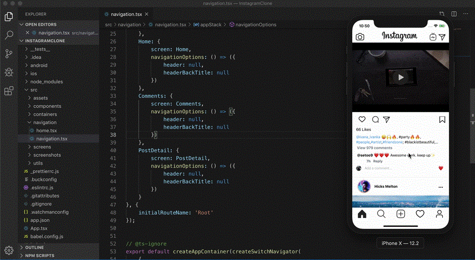
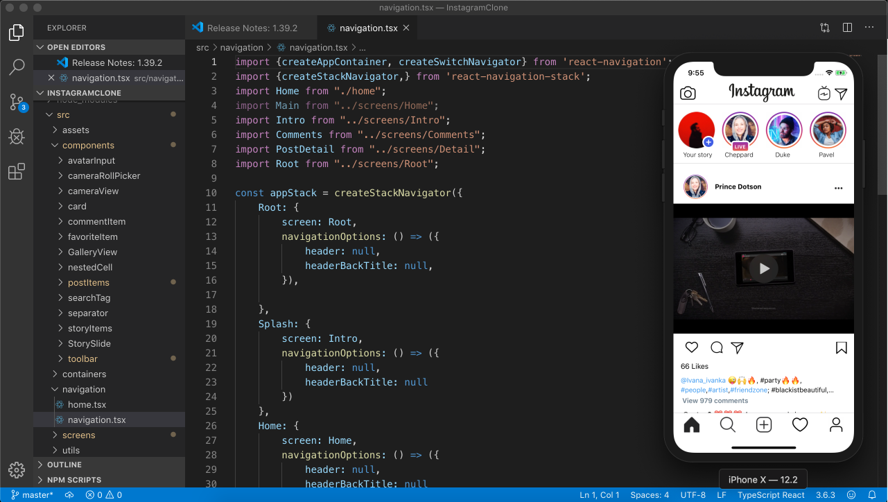
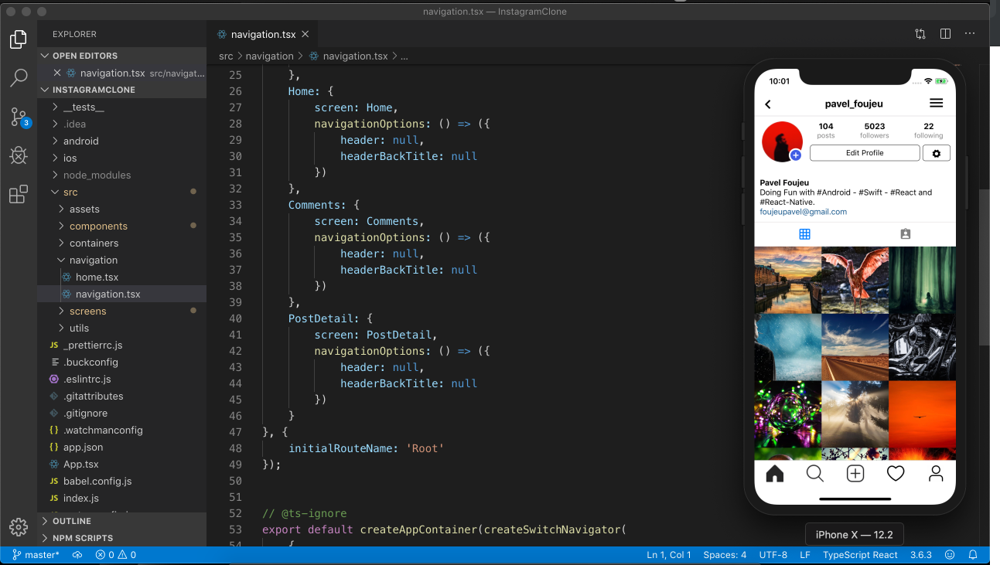

# InstagramClone
Projeto React-Native Clone Istagram


# InstagramClone

>A clone do Instagram React, React-native and Typescript. 

##  Preview



##  Screen (Home)


##  Screen (Profile)


### Dependencies

 - React Native (With Typescript)
 - Native Base
 - React Navigation
 - Others (See package.json at the root folder)
 
 ## Get Started
 
 #### 1. Clone the Repo
 
 On the command prompt run the following commands
 ```sh
 $ git clone https://github.com/Rodrigo-Mesquitaa/InstagramClone
 
 $ cd InstagramClone
 
 $ npm install

 $ grep -rl "s.dependency 'React/Core'" node_modules/ | xargs sed -i '' 's=React/Core=React-Core=g' // To replace React/Core with React-core for all dependencies that use it 
 
 $ cd ios && pod install && cd..
 
 $ react-native run-ios
 